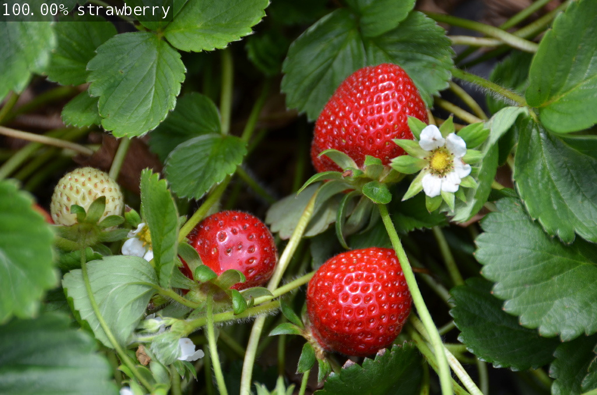

# Two Days to a Demo

Cookbook for the [Nvidia Official Demos on Jetson Xavier](https://developer.nvidia.com/embedded/twodaystoademo)

> by [stevelimyh](https://github.com/stevelimyh), [SS47816](https://github.com/SS47816)
>
> @ NUS Advanced Robotics Centre
>
> MIT License

---

## [Hello AI World](https://github.com/dusty-nv/jetson-inference#hello-ai-world)


### Prerequisites
#### Setting up Jetson with JetPack
JetPack should be ready on your Xavier if you followed the steps in our [Xavier Setup Guide](https://github.com/SS47816/ARC-Starter-Cookbook/blob/master/Xavier_Setup_Guide.md).

#### [Building the Inferencing Library](https://github.com/dusty-nv/jetson-inference/blob/master/docs/building-repo-2.md)
A library of TensorRT-accelerated deep learning networks for image recognition, object detection with localization (i.e. bounding boxes), and semantic segmentation. Noted that GoogleNet and ResNet-18 networks are selected and downloaded during the [build step](https://github.com/dusty-nv/jetson-inference/blob/master/docs/building-repo-2.md#downloading-models).

Summary of the commands to download, build, and install the project:
```bash
$ cd ~
$ sudo apt-get install git cmake
$ git clone --recursive https://github.com/dusty-nv/jetson-inference
$ cd jetson-inference
$ mkdir build
$ cd build
$ cmake ../
$ make -j$(nproc)
$ sudo make install
$ sudo ldconfig
```

### [Image Classification with ImageNet](https://github.com/dusty-nv/jetson-inference/blob/master/docs/imagenet-console-2.md)
In this section, you will be going through a tutorial on **image recognition**, using classifcation networks that have been trained on large datasets to identify scenes and objects.

#### [ImageNet Sample Program]
- [imagenet.cpp](https://github.com/dusty-nv/jetson-inference/blob/master/examples/imagenet/imagenet.cpp)
- [imagenet.py](https://github.com/dusty-nv/jetson-inference/blob/master/python/examples/imagenet.py)

---

#### [Using ImageNet on Jetson]
```bash
$ cd jetson-inference/build/aarch64/bin

# C++
$ ./imagenet-console --network=googlenet images/orange_0.jpg output_0.jpg     # --network flag is optional (default is googlenet)

# Python
$ ./imagenet-console.py --network=googlenet images/orange_0.jpg output_0.jpg  # --network flag is optional (default is googlenet)

```

The first time you run each model, TensorRT will take a few minutes to optimize the network, so future runs using the model will load faster.


```bash
# C++
$ ./imagenet images/strawberry_0.jpg output_1.jpg

# Python
$ ./imagenet.py images/strawberry_0.jpg output_1.jpg

```



---

#### [Using Different Classification Models]
For this tutorial, GoogleNet and ResNet-18 networks are downloaded during the build step.

You can download additional networks, run the [Model Downloader](https://github.com/dusty-nv/jetson-inference/blob/master/docs/building-repo-2.md#downloading-models) tool

```bash
$ cd jetson-inference/tools
$ ./download-models.sh

```

The default classification model for the imagenet program is GoogleNet. Now, let's change that to ResNet-18:


```bash
# C++
$ ./imagenet --network=resnet-18 images/coral.jpg output_coral.jpg

# Python
$ ./imagenet.py --network=resnet-18 images/coral.jpg output_coral.jpg

```


---

#### [Processing Video]
The imagenet program can handle [different types of streams](https://github.com/dusty-nv/jetson-inference/blob/master/docs/aux-streaming.md) other than image.
Now let's try running it on a test video from disk:

```bash
# Download test video (thanks to jell.yfish.us)
$ wget https://nvidia.box.com/shared/static/tlswont1jnyu3ix2tbf7utaekpzcx4rc.mkv -O jellyfish.mkv

# C++
$ ./imagenet --network=resnet-18 jellyfish.mkv jellyfish_resnet18.mkv

# Python
$ ./imagenet.py --network=resnet-18 jellyfish.mkv jellyfish_resnet18.mkv

```
The program output should be similar to this video.
<a href="https://www.youtube.com/watch?v=GhTleNPXqyU" target="_blank"></a>

---

## Deploying Deep Learning


---

## [Advanced - Deep Learning Nodes for ROS](https://github.com/dusty-nv/ros_deep_learning)


### Install Dependencies
```bash
$ cd ~
$ sudo apt-get install git cmake
$ git clone --recursive https://github.com/dusty-nv/jetson-inference
$ cd jetson-inference
$ mkdir build
$ cd build
$ cmake ../
$ make -j$(nproc)
$ sudo make install
$ sudo ldconfig
```

### Install ROS (Melodic)

#### Installation and Setup `catkin_ws`
The installation steps on Xavier is no different from the steps on PC
You may follow the [ROS official installation guide](http://wiki.ros.org/melodic/Installation/Ubuntu) or if you are lazy, just use the condensed code below (from [ROS on Xavier](https://www.jetsonhacks.com/2018/10/26/robot-operating-system-ros-on-nvidia-jetson-agx-xavier-developer-kit/)):

```bash
# clone this guy's repo
git clone https://github.com/jetsonhacks/installROSXavier.git
cd installROSXavier

# install
./installROS.sh -p ros-melodic-desktop -p ros-melodic-rgbd-launch

# after the installation, setup the catkin_ws
./setupCatkinWorkspace.sh
```

#### Testing

In this section, you may follow the [official guide here](https://github.com/dusty-nv/ros_deep_learning) to use all the Demos provided by Nvidia.

Since there's not camera on the Xavier Developer Board, you need a additional camera moduel pluged into the Xavier to get the official guides work. 

However, you can still try some cool stuffs without a camera, by reading a video or image from file. To do that, you need to replace the input path in the all the `launch` commands with another appropriate param accroding to [this documentation](https://github.com/dusty-nv/jetson-inference/blob/master/docs/aux-streaming.md).

---

## [Advanced - TensorFlow to TensorRT Image Classification](https://github.com/NVIDIA-AI-IOT/tf_to_trt_image_classification)

### 1. Setup

### 2. Creating Frozen Graphs

### 3. Converting Frozen Graphs

### 4. Executing TensorRT

### 5. Benchmarking