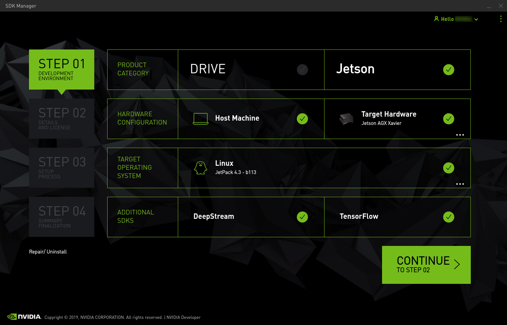
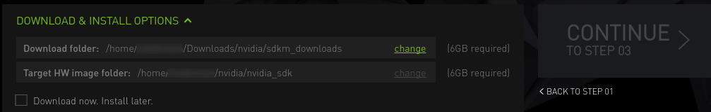
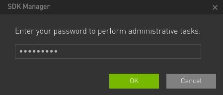
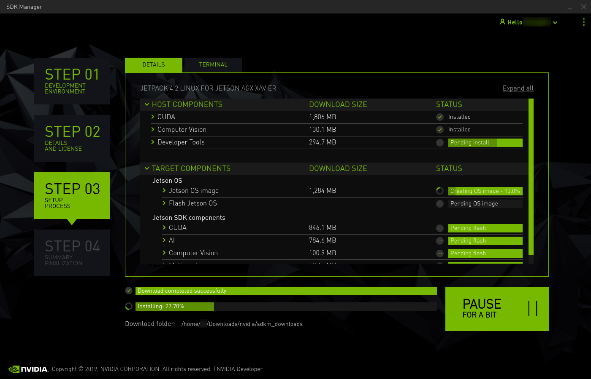
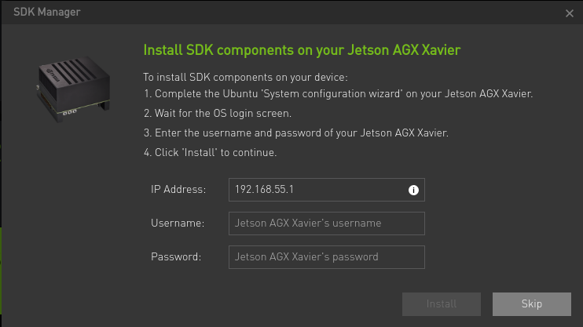

# Xavier Setup Guide

Cookbook for new Robotics students

> by [SS47816](https://github.com/SS47816)
>
> @NUS Advanced Robotics Centre
>
> MIT License


## Prerequisite

* A Host PC with Ubuntu 18.04/16.04
* An entire Nvidia AGX Xavier Developer Kit Set (Standard Version)
* An Ethernet Cable
* A HDMI Cable
* A Monitor, a set of Mouse plus Keyboard for the Xavier
* Internet Connection (with a Internet Router/Port nearby)


## Setup

Download SDK Manager (v1.1.0) on your Host PC from the [Nvidia Website](https://developer.nvidia.com/nvidia-sdk-manager)


### Hardware Connection

1. Connect your Xavier to your Host PC via the USB-C Cable provided.
2. Connect your Xavier to the Internet Router/Port via the Ethernet Cable.
3. Connect your Xavier to the Monitor, Mouse, and Keyboard.
4. Connect your Xavier to the power.
5. Press down the **Reset** button(the second from the left) and **hold**.
6. Press down the **Power** button(the first from the left) and **hold**.
7. Release **both** buttons.


### Flash the Jeston OS for Xavier

The Official Guide is [here](https://docs.nvidia.com/sdk-manager/install-with-sdkm-jetson/index.html).

#### Login

1. Open the SDK Manager on your Host PC.
2. Login using your Nvidia Developer Account.

#### STEP 01



1. Select **Jetson** on the first line.
2. Select Host Machine and **Jetson AGX Xavier** as Target Machine.
3. Select **Linux JetPack 4.3**.
4. Select **DeepSteam**.
5. Click **CONTINUE**

#### STEP 02



1. Make sure you have enough storage space at these two locations

2. Click "**Agree**" to the Terms and Conditions.

3. Click **CONTINUE**

4. Enter your Host PC **Password**

   

#### STEP 03



1. Wait until the jobs are finished

2. When you see this pop-up window:

   

3. Go to your Xavier Monitor and Complete the Ubuntu '**System configuration wizard**' on your Jetson AGX Xavier.

4. Wait for the OS login screen.

5. Enter the **username** and **password** of your Jetson AGX Xavier.

6. Click '**Install**' to continue.

7. When you see this pop-up window:

   

#### STEP 04

Succeed!

## [ROS on Xavier](https://www.jetsonhacks.com/2018/10/26/robot-operating-system-ros-on-nvidia-jetson-agx-xavier-developer-kit/)
```bash
# clone this guy's repo
git clone https://github.com/jetsonhacks/installROSXavier.git
cd installROSXavier

# install
./installROS.sh -p ros-melodic-desktop -p ros-melodic-rgbd-launch

# after the installation, setup the catkin_ws
./setupCatkinWorkspace.sh
```

## Developer Tools on Xavier
Due to the ARM architechture used on Jetson products, most of the software can't be installed as normally. However, if you love these tools as I do, you can try build them from source alternatively.

### Visual Studio Code ([This Youtube Video](https://www.youtube.com/watch?time_continue=191&v=_ODzBmI5lPA&feature=emb_logo))

#### Install
```bash
sudo apt install curl

cd Downloads
curl -L https://github.com/toolboc/vscode/releases/download/1.32.3/code-oss_1.32.3-arm64.deb -o code-oss_1.32.3-arm64.deb

sudo dpkg -i code-oss_1.32.3-arm64.deb
```

#### Use
Go to your programs and find `Code-OSS`

