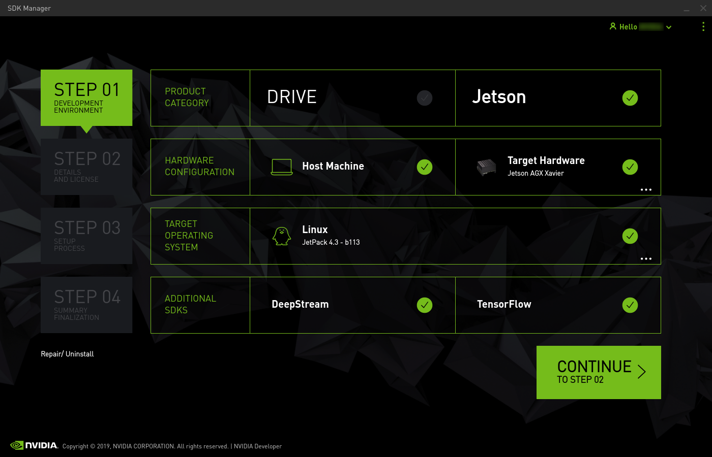
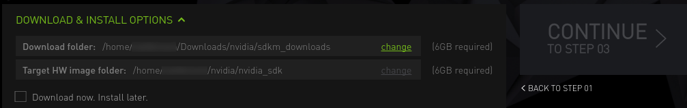
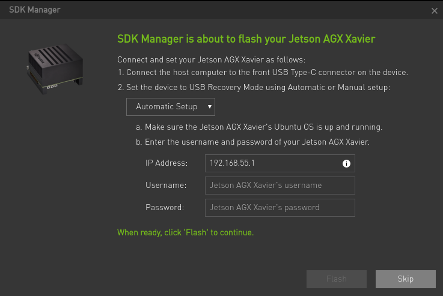

# Xavier Setup Guide

Cookbook for new Robotics students

> by [SS47816](https://github.com/SS47816)
>
> @ NUS Advanced Robotics Centre
>
> MIT License


## Prerequisite

* A Host PC with Ubuntu 18.04/16.04
* An entire Nvidia AGX Xavier Developer Kit Set (Standard Version)
* A HDMI Cable
* A Monitor, a set of Mouse plus Keyboard for the Xavier
* Internet Connection (with a Internet Router/Port nearby), with an Ethernet Cable OR a Wifi card to plug into a M2 connector OR a Wifi dongle


## Setup

Download SDK Manager (v1.1.0) on your Host PC from the [Nvidia Website](https://developer.nvidia.com/nvidia-sdk-manager)


### Hardware Connection

1. Connect your Xavier to your Host PC via the USB-C Cable provided.
2. Connect your Xavier to the Internet Router/Port via the Ethernet Cable.
3. Connect your Xavier to the Monitor, Mouse, and Keyboard.
4. Connect your Xavier to the power.
5. Press down the **Reset** button(the second from the left) and **hold**.
6. Press down the **Power** button(the first from the left) and **hold**.
7. Release **both** buttons.


### Flash the Jeston OS for Xavier

Follow this Official Guide [here](https://docs.nvidia.com/sdk-manager/install-with-sdkm-jetson/index.html).

#### Login

1. Open the SDK Manager on your Host PC.
2. Login using your Nvidia Developer Account.

#### STEP 01



1. Select **Jetson** on the first line.
2. Select Host Machine and **Jetson AGX Xavier** as Target Machine.
3. Select **Linux JetPack 4.3**.
4. Select **DeepSteam**.
5. Click **CONTINUE**

#### STEP 02



1. Make sure you have enough storage space at these two locations

2. Click "**Agree**" to the Terms and Conditions.

3. Click **CONTINUE**

4. Enter your Host PC **Password**

   

#### STEP 03


1. Wait until the jobs are finished

2. When you see this pop-up window:

   

3. Go to your Xavier Monitor and Complete the Ubuntu '**System configuration wizard**' on your Jetson AGX Xavier.

4. Wait for the OS login screen.

5. Enter the **username** and **password** of your Jetson AGX Xavier.

6. Click '**Install**' to continue.

7. When you see this pop-up window:

   

#### STEP 04

Succeed!

---

## [Install SSD on Xavier](https://medium.com/@ramin.nabati/installing-an-nvme-ssd-drive-on-nvidia-jetson-xavier-37183c948978)
You can refer to this [blog](https://medium.com/@ramin.nabati/installing-an-nvme-ssd-drive-on-nvidia-jetson-xavier-37183c948978)


---
## Git
```bash
#!bash
git config --global user.email "you@example.com"
git config --global user.name "Your Name"

git config credential.helper store
git push
```

---
## Jetson-Stats

```
sudo apt install python3-pip
sudo -H pip3 install -U jetson-stats

```

---


## Developer Tools on Xavier
Due to the ARM architechture used on Jetson products, most of the software can't be installed as normally. However, if you love these tools as I do, you can try build them from source alternatively.

## Visual Studio Code ([This Youtube Video](https://www.youtube.com/watch?time_continue=191&v=_ODzBmI5lPA&feature=emb_logo))

#### Install
```bash
#!bash
sudo apt install curl

cd Downloads
curl -L https://github.com/toolboc/vscode/releases/download/1.32.3/code-oss_1.32.3-arm64.deb -o code-oss_1.32.3-arm64.deb

sudo dpkg -i code-oss_1.32.3-arm64.deb
```

#### Use
Go to your programs and you can find `Code-OSS`

By default, the command to launch vscode from terminal is `code-oss`.
To change it to `code`:

```bash
#!bash
cd /usr/bin/
sudo ln -s code-oss code
```

---

## [OpenCV 3.4.3](https://github.com/jetsonhacks/buildOpenCVXavier)
The following command is extracted from this [Blog](https://www.jetsonhacks.com/2018/11/08/build-opencv-3-4-on-nvidia-jetson-agx-xavier-developer-kit/)

```bash
#!bash
# Remove the OpenCV installed by JetPack before performing this script installation
sudo apt-get purge libopencv*

# To download the source, build and install OpenCV
wget https://raw.githubusercontent.com/JetsonHacksNano/buildOpenCV/master/buildOpenCV.sh
chmod +x buildOpenCV.sh

# Change ARCH_BIN=7.2 (Xavier)
# DOWNLOAD_OPENCV_EXTRAS=YES
./buildOpenCV

# Make a symlink to /usr/include
sudo ln -s /usr/local/include/opencv /usr/include/opencv
```


```bash
# You can remove the sources and build files after you are done
./removeOpenCVSources.sh

# Test the OpenCV with the programs in the `Examples` folder
cd Examples/
g++ -o gstreamer_view -Wall -std=c++11 gstreamer_view.cpp $(pkg-config –libs opencv)
./gstreamer_view

# To run the Canny detection demo (Python 2.7):
python cannyDetection.py

# With Python 3.3:
python3 cannyDetection.py
```

## Eigen 3.3.9
```bash
# Remove old eigen
sudo apt autoremove libeigen3-dev

sudo rm -rf /usr/include/eigen3 /usr/lib/cmake/eigen3 /usr/share/doc/libeigen3-dev /usr/share/pkgconfig/eigen3.pc /var/lib/dpkg/info/libeigen3-dev.list /var/lib/dpkg/info/libeigen3-dev.md5sums

# Install
wget https://gitlab.com/libeigen/eigen/-/archive/3.3.9/eigen-3.3.9.zip
unzip eigen-3.3.9.zip
cd eigen-3.3.9 && mkdir build
cd build && cmake ..
sudo make install

# Make a symlink to /usr/include
sudo ln -s /usr/local/include/eigen3 /usr/include
```


## [ROS on Xavier](https://www.jetsonhacks.com/2018/10/26/robot-operating-system-ros-on-nvidia-jetson-agx-xavier-developer-kit/)

```bash
#!bash
# clone this guy's repo
git clone https://github.com/jetsonhacks/installROSXavier.git
cd installROSXavier

# install
./installROS.sh -p ros-melodic-desktop -p ros-melodic-rgbd-launch

# (Optional) after the installation, setup the catkin_ws
./setupCatkinWorkspace.sh
```

---

## Arduino IDE
```bash
#!bash
git clone https://github.com/JetsonHacksNano/installArduinoIDE

cd installArduinoIDE

sudo ./installArduinoIDE.sh
```